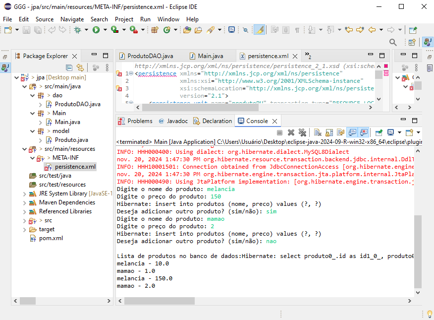
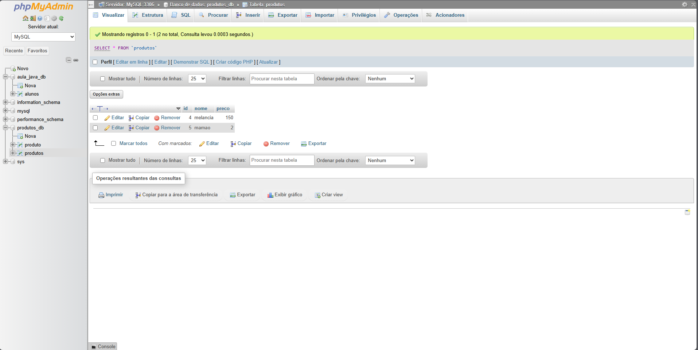

# Lista de Exercícios - Atividade individual - JPA

Projeto da matéria de POO FACENS

## 🚀 Começando

* CRIE UM PROJETO EM JAVA E REPRODUZA O EXEMPLO DO SOBRE O TEMA DA AULA DE JPA;

* NO EXEMPLO, SERÁ NECESSÁRIO UTILIZAR O WAMP PARA ACESSO DO BANCO DE DADOS MYSQL, CONFIRA INFORMAÇÕES NO CONTEÚDO DA AULA 11 - WAMP;

* APÓS A CONFIGURAÇÃO DO AMBIENTE, CRIAÇÃO DO PROJETO MAVEN E SUAS RESPECTIVAS CLASSES;

* AO TÉRMINO CRIE UM REPOSITÓRIO REMOTO COM NOME JPA;

* PARA ENTREGA DENTRO DO README.MDINSIRA AS SEGUINTES IMAGENS:

## 🛠️ Construído com

* Eclipse 

## 📌 Versão

* **Versão 1.0** 

## ✒️ Autores

* **Abrão Alves Trevizan** - *Atividade individual - JPA* 